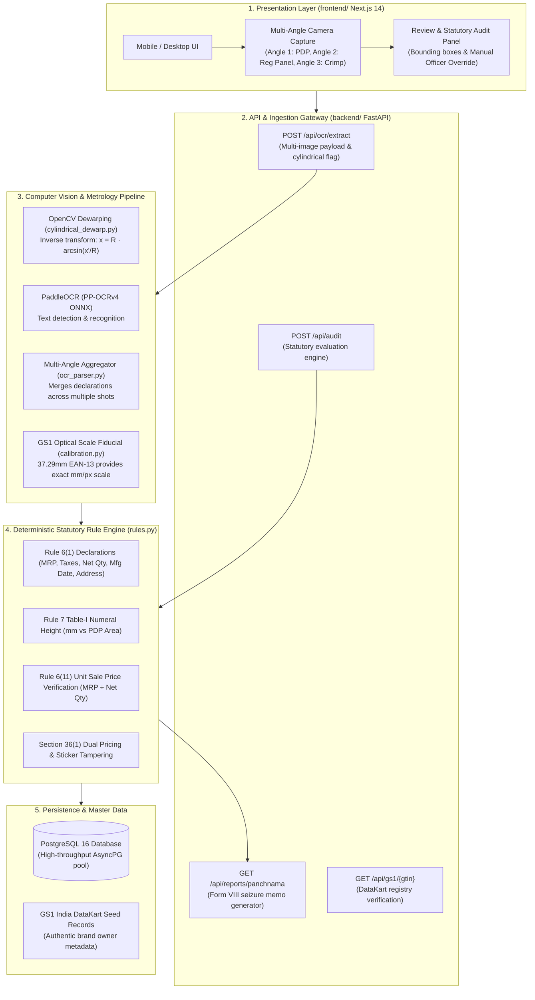

# e-LMPC RADAR : Technical Architecture & System Design

**Smart India Hackathon 2026 — Problem Statement 26034**  
*Department of Consumer Affairs (DoCA), Ministry of Consumer Affairs, Food & Public Distribution*

---

## 1. System Topology



---

## 2. Directory Layout & Module Responsibilities

```
sih/
├── Makefile                      # Team command runner (start, test, lint, clean)
├── start.sh                      # Single unified launcher (PostgreSQL + FastAPI + Next.js)
├── README.md                     # Project overview and setup instructions
├── ARCHITECTURE.md               # System design and pipeline topology
├── TESTING.md                    # Comprehensive test guide and API examples
├── .gitignore                    # Production gitignore (filters out caches and build artifacts)
├── .vscode/                      # Team VS Code settings (Pylance path resolution, Ruff on save)
│   ├── settings.json
│   └── extensions.json
│
├── backend/                      # Python FastAPI Statutory Compliance Service
│   ├── main.py                   # FastAPI entrypoint with async lifespan pool manager
│   ├── pyproject.toml            # Python 3.10+ package metadata and Ruff linting rules
│   ├── requirements.txt          # Python dependencies
│   ├── app/
│   │   ├── config.py             # App settings (database URL, ports, optical constants)
│   │   ├── database.py           # AsyncPG connection pool and PostgreSQL tables
│   │   ├── schemas.py            # Pydantic v2 CamelModel schemas (bidirectional camelCase)
│   │   ├── api/
│   │   │   ├── routes_ocr.py     # Multi-image OCR ingestion endpoint
│   │   │   ├── routes_inspect.py # Statutory rule evaluation and audit endpoints
│   │   │   └── routes_gs1.py     # GS1 DataKart query endpoints
│   │   └── engine/
│   │       ├── calibration.py    # GS1 EAN-13 barcode optical scale fiducial math
│   │       ├── cylindrical_dewarp.py # Inverse cylindrical unrolling via OpenCV remap
│   │       ├── ocr_parser.py     # Statutory lexical parser & multi-angle aggregator
│   │       ├── panchnama.py      # Legal Metrology Form VIII Panchnama Notice compiler
│   │       ├── rules.py          # Deterministic LMPC statutory evaluation engine
│   │       └── sample_data.py    # Curated packaging test cases
│   └── tests/
│       └── test_inspection.py    # End-to-end regression test suite
│
├── frontend/                     # Next.js 14 Frontend Application
│   ├── package.json              # Next.js dependencies and build scripts
│   ├── tailwind.config.js        # Official Government / Legal Metrology palette
│   └── src/
│       ├── app/                  # Next.js App Router (page.tsx, layout.tsx)
│       ├── components/           # UI widgets (CameraUploadModal, InspectionView, etc.)
│       ├── lib/                  # Client-side barcode scanning and sample data
│       └── types/                # Strict TypeScript interfaces (lmpc.ts)
│
└── rescources/                   # SIH Problem Statement, regulatory acts, and test images
    ├── SIH26034.md               # SIH Problem Statement description
    ├── law/                      # Official Government Gazettes and Legal Metrology Acts
    ├── facewash-image.jpeg       # Benchmark squeeze tube test specimen
    ├── test-sample-box.jpg       # Carton package test specimen
    ├── test-sample-curved-bottle.jpg # Cylindrical curved bottle test specimen
    └── test-sample-tube.jpg      # Squeeze tube test specimen
```

---

## 3. Key Technical Decisions

1. **Pure PaddleOCR (Zero Tesseract)**:
   - RapidOCR ONNX runtime running PP-OCRv4 achieves sub-second inference on standard CPU hardware without GPU requirements.
2. **Deterministic Mathematical Compliance vs LLMs**:
   - Court admissibility requires 100% reproducible evidence. The statutory rule engine calculates font heights ($S \times \text{px}$), Unit Sale Price ($\text{MRP} / \text{Qty}$), and standard SI symbols with exact mathematical formulas rather than probabilistic LLMs.
3. **GS1 Barcode as Optical Fiducial**:
   - Solves the physical scale problem without requiring inspectors to carry physical calibration rulers. Standard GS1 EAN-13 barcodes are manufactured to nominal $37.29\text{ mm}$ width.
4. **Multi-Angle Ingestion**:
   - Solves reflections and cylindrical packaging by aggregating OCR tokens across multiple photos taken by the inspector.
