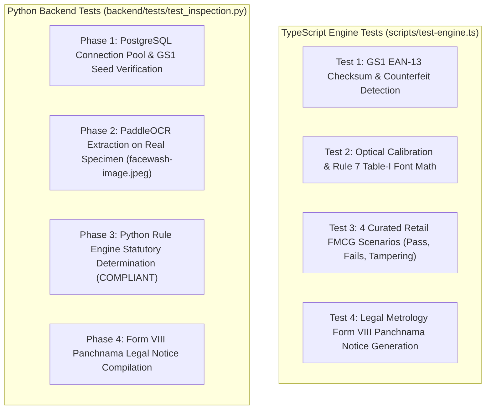

# e-LMPC RADAR : Testing & Verification Guide

This document explains how to test the **e-LMPC RADAR** statutory compliance platform across the Python FastAPI backend, Next.js frontend, computer vision pipelines, and database.

---

## 1. Quick Automated Test Commands

```bash
# Run ALL tests (Python + TypeScript)
make test-all

# Run Python Backend test (PaddleOCR + DB + Rule Engine + Panchnama)
make test

# Run TypeScript Statutory Rule test (Checksums, Rule 7 Calibration, Edge Cases)
make test-ts

# Run Ruff Code Quality & Modern Typing Linter
make lint
```

---

## 2. Test Architecture & Coverage



---

## 3. Testing with Real Packaging Images

Sample benchmark images are stored in [`rescources/`](file:///home/dev/work/sih/rescources):

| Image File | Description | Key Testing Focus |
| :--- | :--- | :--- |
| [`facewash-image.jpeg`](file:///home/dev/work/sih/rescources/facewash-image.jpeg) | Real facewash squeeze tube (Cipla / Pontika Aerotech) | Embossed crimp date under Rule 6(1)(d) proviso, MRP ₹195, Net Qty 100ml. |
| [`test-sample-curved-bottle.jpg`](file:///home/dev/work/sih/rescources/test-sample-curved-bottle.jpg) | Curved sunscreen bottle with lighting reflections | Cylindrical de-warping (`cylindrical_dewarp.py`), curved text unrolling. |
| [`test-sample-box.jpg`](file:///home/dev/work/sih/rescources/test-sample-box.jpg) | High-resolution retail carton package | Standard flat panel OCR, Rule 7 numeral height calibration. |
| [`test-sample-tube.jpg`](file:///home/dev/work/sih/rescources/test-sample-tube.jpg) | Front & back squeeze tube | Net quantity extraction and regulatory back panel. |

---

## 4. Testing Endpoints via Swagger UI & cURL

Once the application is running (`./start.sh` or `make start`):
* **FastAPI Interactive Swagger Docs**: [http://localhost:8000/docs](http://localhost:8000/docs)
* **Frontend Web Dashboard**: [http://localhost:3000](http://localhost:3000)

### 4.1 Health Check
```bash
curl -X GET http://localhost:8000/health
# Response: {"status": "healthy", "service": "lmpc-fastapi-backend"}
```

### 4.2 OCR Ingestion Endpoint (`/api/ocr/extract`)
```bash
# Extract declarations from base64 image
curl -X POST http://localhost:8000/api/ocr/extract \
  -H "Content-Type: application/json" \
  -d '{
    "images": ["<base64_encoded_image_string>"],
    "isCylindrical": false
  }'
```

### 4.3 Statutory Audit Evaluation (`/api/audit`)
```bash
curl -X POST http://localhost:8000/api/audit \
  -H "Content-Type: application/json" \
  -d '{
    "barcode": "8901063012011",
    "customDeclarations": {
      "mrp": 30.0,
      "hasInclusiveOfTaxes": true,
      "netQuantityValue": 120,
      "netQuantityUnit": "g",
      "declaredUsp": 0.25,
      "declaredUspUnit": "g",
      "manufacturerName": "Britannia Industries Limited",
      "manufacturerAddress": "Bidadi, Bengaluru, Karnataka - 562109",
      "countryOfOrigin": "India",
      "manufacturingDate": "08/2024"
    },
    "customCalibration": {
      "barcodeWidthPx": 380,
      "barcodeHeightPx": 260,
      "numeralHeightPx": 32,
      "numeralWidthPx": 16,
      "pdpAreaCm2": 120
    }
  }'
```

### 4.4 GS1 Master Registry Lookup (`/api/gs1/{gtin}`)
```bash
curl -X GET http://localhost:8000/api/gs1/8901063012011
```

---

## 5. Adding New Test Cases

1. **Python**: Add test assertions in [`backend/tests/test_inspection.py`](file:///home/dev/work/sih/backend/tests/test_inspection.py).
2. **Curated Scenarios**: Add sample cases in [`backend/app/engine/sample_data.py`](file:///home/dev/work/sih/backend/app/engine/sample_data.py) and [`frontend/src/lib/engine/sampleData.ts`](file:///home/dev/work/sih/frontend/src/lib/engine/sampleData.ts).
